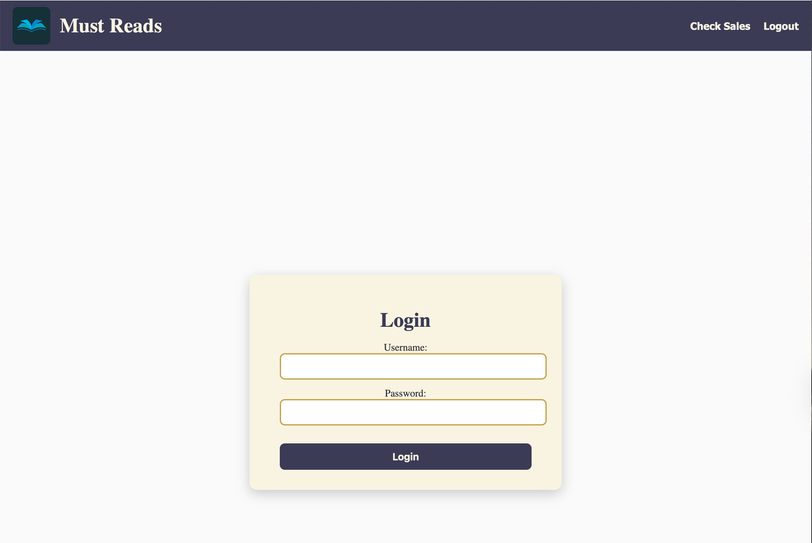
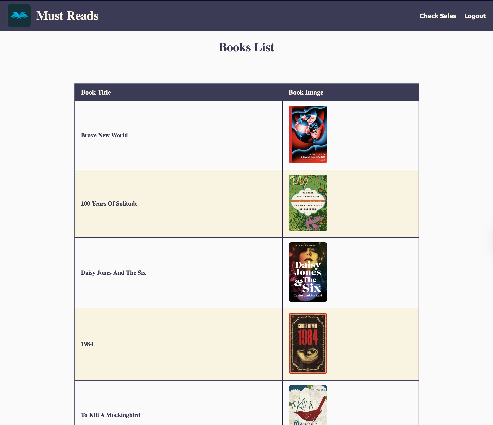
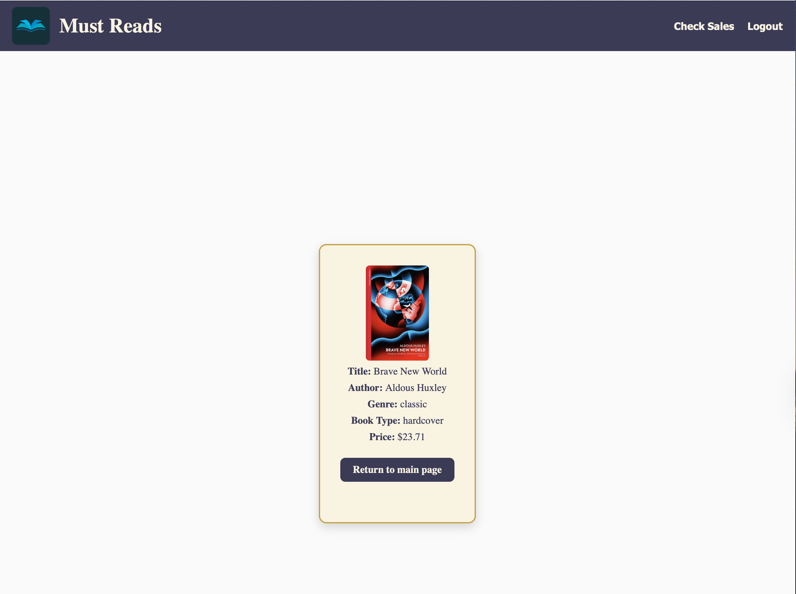

# Bookstore App

A Django web application for managing and viewing books and their sales records. Users can log in, browse a list of books, view details of each book, and check sales data.

---

## Features

- **User Authentication:** Secure login/logout functionality.
- **Book List:** View a list of all books in the store.
- **Book Details:** Click on a book to see detailed information including:
  - Title
  - Author
  - Genre
  - Book Type (Hardcover, Paperback, etc.)
  - Price
  - Book Image
- **Sales Records:** Search for a book by title to view sales data and charts.
- **Responsive Design:** Works on desktop and mobile devices.

---

## Screenshots

**Welcome Page**

Users land on the welcome page where they can access login.  


**Login Page**

User login to access the app.  



**Books List**

Once logged in users see a list of all books.  

 

**Book Detail**

Click on a book to view its details.  



---

## Installation

### Prerequisites

- Python 3.13+
- pip
- PostgreSQL (or SQLite for local development)
- Heroku CLI (for deployment)

### Setup

1. Clone the repository:
   ```bash
   git clone https://github.com/LindsellR/Bookstore.git
   cd Bookstore
````

2. Create a virtual environment and activate it:

   ```bash
   python -m venv venv
   source venv/bin/activate  # Mac/Linux
   venv\Scripts\activate     # Windows
   ```

3. Install dependencies:

   ```bash
   pip install -r requirements.txt
   ```

4. Apply database migrations:

   ```bash
   python manage.py migrate
   ```

5. Collect static files:

   ```bash
   python manage.py collectstatic
   ```

6. Create a superuser for admin access:

   ```bash
   python manage.py createsuperuser
   ```

7. Run the development server:

   ```bash
   python manage.py runserver
   ```

---

## Usage

* Navigate to `/login/` to log in.
* Browse the list of books at `/books/list/`.
* Click on a book to view its details.
* Check sales records by entering the book title on the sales page.
* Return to book list page or Logout using the link in the navigation bar.

---

## Deployment

* The app can be deployed on **Heroku**.
* Make sure to set `ALLOWED_HOSTS` and configure the database using `dj-database-url`.
* Static files are served using **WhiteNoise** for production.

---

## Requirements

See [`requirements.txt`](requirements.txt):

```
asgiref==3.9.1
contourpy==1.3.3
cycler==0.12.1
dj-database-url==3.0.1
Django==5.2.5
fonttools==4.59.2
gunicorn==23.0.0
kiwisolver==1.4.9
matplotlib==3.10.6
numpy==2.3.3
packaging==25.0
pandas==2.3.2
pillow==11.3.0
pyparsing==3.2.3
python-dateutil==2.9.0.post0
pytz==2025.2
six==1.17.0
sqlparse==0.5.3
tzdata==2025.2
whitenoise==6.11.0
psycopg2-binary
```

---

## Contact

For any questions or feedback, please contact Richard Lindsell (mailto:lindsellrichard@gmail.com).

```
